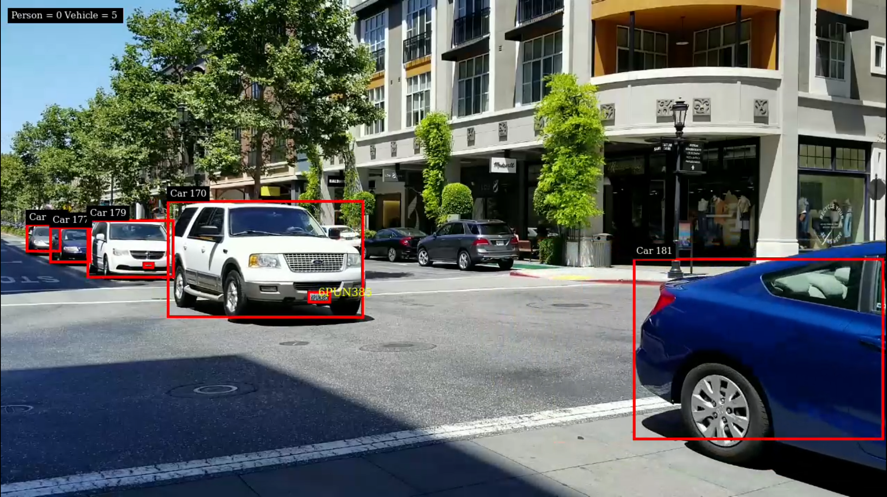

# Sample For Car License Recognization
 - [Description](#description)
 - [Prerequisition](#prerequisition)
 - [Download](#download)
 - [Build and Run](#build-and-run)
 - [Notice](#notice)

---

## Description
This sample is to show how to use graded models for detection and classification with DeepStream SDK version not less than 5.0.1. The models in this sample are all TAO3.0 models.

`PGIE(car detection) -> SGIE(car license plate detection) -> SGIE(car license plate recognization)`


This pipeline is based on two custom models and a TAO model bellow:

* Car detection custom model
* LPD (car license plate detection) custom model
* LPR (car license plate recognization/text extraction) model https://ngc.nvidia.com/catalog/models/nvidia:tao:lprnet

More details for TAO3.0 LPR model and TAO training, please refer to [TAO document](https://docs.nvidia.com/tao/tao-toolkit/text/overview.html).


## Prerequisition

* [DeepStream SDK 6.0 or above](https://developer.nvidia.com/deepstream-getting-started)

  Make sure deepstream-test1 sample can run successful to verify your DeepStream installation

* [tao-converter](https://catalog.ngc.nvidia.com/orgs/nvidia/teams/tao/resources/tao-converter/version)

  Download x86 or Jetson tao-converter which is compatible to your platform from the links in https://catalog.ngc.nvidia.com/orgs/nvidia/teams/tao/resources/tao-converter/version.
 
## Download

1. Prepare Models

All TAO models can be downloaded with the following commands:

```
    cd deepstream_lpr_app/
```
```
    ./download.sh
```

The custom Darknet's models are already in the ```models/vehicle_detection``` and ```models/plate_detection```.

## Build and Run

1. Export CUDA version
```
export CUDA_VER=XY.Z
```

2. Build
```
    make
    cd deepstream-lpr-app
```

3. Change input file path at ```source-list->list``` from ```lpr_app_infer_spice_config.yml```.

4. Change output definition at ```output``` from ```lpr_app_infer_spice_config.yml```.

Start to run the application with YAML config file (nvinfer).
```
    ./deepstream-lpr-app lpr_app_infer_spice_config.yml
```



## Notice

After first run, change the location of neural networks weights:
```
    mv ./deepstream_lpr_app/deepstream-lpr-app/model_b1_gpu0_fp16.engine ./deepstream_lpr_app/models/vehicle_detection
```
```
    mv ./deepstream_lpr_app/deepstream-lpr-app/model_b16_gpu0_fp16.engine ./deepstream_lpr_app/models/plate_detection
```

This ***DEEPSTREAM-LPR-App*** will only recognize license plates if the output of the last neural network matches 7 characters. In addition, the *antiga* model license plate will always be in LLLNNNN format and the *nova* (Mercosul) model in LLLNLNN format.